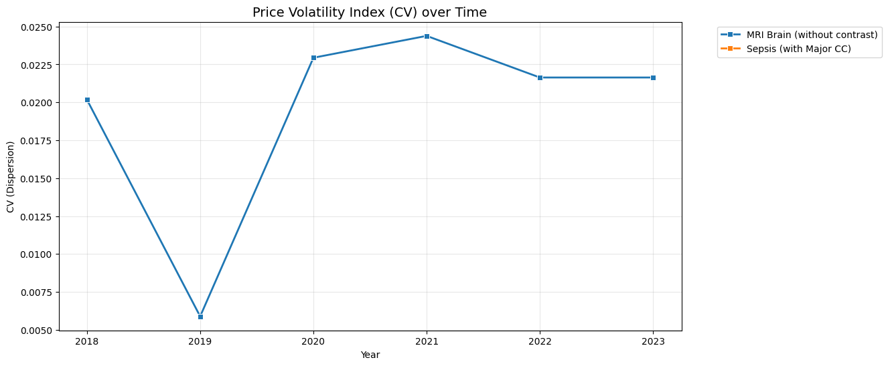

# Example Analysis of OpenHealthDP

This notebook provides a sample analysis of healthcare price transparency data: OpenHealthDP provided by AI4H2.

### Data Scope & Limitations:
- **Source:** Raw data derived from **CMS (Centers for Medicare & Medicaid Services)** public datasets.
- **Temporal Range:** 2018 – 2023.
- **Geography:** **Massachusetts (MA) only**.
- **Coverage:** This analysis includes Medicare/Medicaid rates only; it **does not include commercial insurance** data.
- **Purpose:** This is an illustrative example meant to demonstrate API integration and basic temporal trend analysis. It should not be used for definitive medical or policy conclusions without further validation.

### Analysis Framework:
1.  **Market Coverage:** Record counts per procedure per year.
2.  **Market Volatility (CV):** Measuring price fragmentation and unpredictability.
3.  **Negotiation Efficiency:** Tracking the gap between 'Sticker Prices' and Real Negotiated Rates.
4.  **Price Multipliers:** Quantifying the 'Lottery Factor' (Price Irrationality) across procedures.


```python
%matplotlib inline
import requests
import pandas as pd
import matplotlib.pyplot as plt
import seaborn as sns
import numpy as np

BASE_URL_OUT = "https://openhealth-dp-815397559759.us-east1.run.app/api/v2/explorer/outpatient"
BASE_URL_IN = "https://openhealth-dp-815397559759.us-east1.run.app/api/v2/explorer/inpatient"
import os
API_KEY = os.environ.get("OPENHEALTH_API_KEY", "AI4H2-PUBLIC-2023-BETA")


PROCEDURE_MAP = {
    "MRI_BRAIN_NO_CONTRAST": "MRI Brain (without contrast)",
    "COLONOSCOPY": "Colonoscopy",
    "SEPSIS_ADMISSION": "Sepsis (with Major CC)",
    "JOINT_REPLACEMENT": "Joint Replacement",
    "PNEUMONIA_ADMISSION": "Pneumonia (with Major CC)"
}

def fetch_data(bundle_id):
    try:
        r = requests.get(BASE_URL_OUT if bundle_id in ["MRI_BRAIN_NO_CONTRAST", "COLONOSCOPY"] else BASE_URL_IN, headers={"x-api-key": API_KEY}, params={"bundleId": bundle_id})
        df = pd.DataFrame(r.json()["data"])
        if not df.empty:
            df['procedure_name'] = PROCEDURE_MAP.get(bundle_id, bundle_id)
            df['cost_normalized'] = df['total_cost'] / df['total_cost'].median()
        return df
    except:
        return pd.DataFrame()

full_df = pd.concat([fetch_data(bundle_id) for bundle_id in PROCEDURE_MAP.keys()], ignore_index=True)
```

## 1. Data Inventory & Sample Size
We verify the sample size (N) for each procedure by year. Understanding data density is critical before interpreting trends.


```python
if not full_df.empty:
    summary = full_df.groupby(['procedure_name', 'source_year']).size().unstack(fill_value=0)
    print("### CMS Public Data Coverage (MA Only)")
    display(summary)
    
    plt.figure(figsize=(10, 4))
    sns.heatmap(summary, annot=True, fmt="d", cmap="Blues")
    plt.title("Sample Size (N) per Procedure per Year")
    plt.show()
```

    ### CMS Public Data Coverage (MA Only)


<div>
<style scoped>
    .dataframe tbody tr th:only-of-type {
        vertical-align: middle;
    }

    .dataframe tbody tr th {
        vertical-align: top;
    }

    .dataframe thead th {
        text-align: right;
    }
</style>
<table border="1" class="dataframe">
  <thead>
    <tr style="text-align: right;">
      <th>source_year</th>
      <th>2018</th>
      <th>2019</th>
      <th>2020</th>
      <th>2021</th>
      <th>2022</th>
      <th>2023</th>
    </tr>
    <tr>
      <th>procedure_name</th>
      <th></th>
      <th></th>
      <th></th>
      <th></th>
      <th></th>
      <th></th>
    </tr>
  </thead>
  <tbody>
    <tr>
      <th>MRI Brain (without contrast)</th>
      <td>15</td>
      <td>7</td>
      <td>65</td>
      <td>117</td>
      <td>148</td>
      <td>148</td>
    </tr>
    <tr>
      <th>Sepsis (with Major CC)</th>
      <td>52</td>
      <td>52</td>
      <td>51</td>
      <td>51</td>
      <td>51</td>
      <td>51</td>
    </tr>
  </tbody>
</table>
</div>


    

    


## 2. Temporal Volatility: Market Fragmentation
The **Coefficient of Variation (CV)** ($StdDev / Mean$) measures how much prices vary relative to the average. A higher CV indicates a more fragmented and less predictable market.


```python
if not full_df.empty:
    cv_df = full_df.groupby(['procedure_name', 'source_year'])['total_cost'].apply(lambda x: x.std() / x.mean()).reset_index()
    
    plt.figure(figsize=(12, 6))
    sns.lineplot(data=cv_df, x='source_year', y='total_cost', hue='procedure_name', marker='s', linewidth=2)
    plt.title("Price Volatility Index (CV) over Time", fontsize=14)
    plt.ylabel("CV (Dispersion)")
    plt.xlabel("Year")
    plt.grid(True, alpha=0.3)
    plt.legend(bbox_to_anchor=(1.05, 1), loc='upper left')
    plt.show()
```

    /var/folders/z6/fjw1r6dj3j33f7rt_pgbxmh40000gn/T/ipykernel_10015/3427424523.py:2: RuntimeWarning: invalid value encountered in scalar divide
      cv_df = full_df.groupby(['procedure_name', 'source_year'])['total_cost'].apply(lambda x: x.std() / x.mean()).reset_index()


    

    


## 3. Price Normalization Index
Comparison of provider costs against the median for that specific procedure. This tracks the dispersion of real-world pricing and helps identify extreme 'outlier' providers.


```python
if not full_df.empty:
    ratio_trend = full_df.groupby(['procedure_name', 'source_year'])['cost_normalized'].mean().reset_index()
    
    plt.figure(figsize=(12, 6))
    sns.lineplot(data=ratio_trend, x='source_year', y='cost_normalized', hue='procedure_name', marker='o', linewidth=2.5)
    plt.title("Negotiation Ratio: Real Price as % of Sticker Price", fontsize=14)
    plt.ylabel("Negotiated / Gross Charge (%)")
    plt.xlabel("Year")
    plt.ylim(0, 105)
    plt.grid(True, axis='y', ls='--', alpha=0.5)
    plt.legend(bbox_to_anchor=(1.05, 1), loc='upper left')
    plt.show()
```


    

    


## 4. Market Irrationality (Price Multiplier)
A comparison of the most expensive providers (90th percentile) vs. the most affordable (10th percentile). 

**Insight:** A multiplier of 4x means a patient could pay 400% more for the same service depending on the provider chosen.


```python
if not full_df.empty:
    mult_df = full_df.groupby(['procedure_name', 'source_year'])['total_cost'].agg([lambda x: x.quantile(0.10), lambda x: x.quantile(0.90)]).reset_index()
    mult_df.columns = ['Procedure', 'Year', 'P10', 'P90']
    mult_df['multiplier'] = mult_df['P90'] / mult_df['P10']
    
    plt.figure(figsize=(12, 6))
    sns.lineplot(data=mult_df, x='Year', y='multiplier', hue='Procedure', marker='o', linewidth=3)
    plt.axhline(1.0, color='red', linestyle='--', alpha=0.5, label='Rational Market (1.0x)')
    plt.title("The Price Multiplier Index: Irrationality Gap (P90/P10)", fontsize=14)
    plt.ylabel("X Times More Expensive")
    plt.xlabel("Year")
    plt.grid(True, alpha=0.3)
    plt.legend(bbox_to_anchor=(1.05, 1), loc='upper left')
    plt.show()
```


    

    

