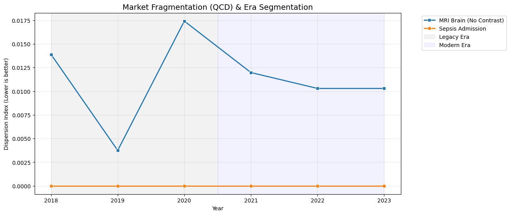

# OpenHealth: Professional Clinical Trend Analysis (2018–2023)

This notebook demonstrates the **Professional Protocol** for analyzing healthcare price transparency data, adhering to the updated `DATA_SCIENCE_GUIDE.md`.

### 🛡️ Analysis Protocols Implemented:
1.  **Identity Bridge (Protocol 1):** Uses **Physical Site Normalization** (Address + City + Zip) to track consistent clinical locations across the 2021 NPI billing shift.
2.  **Regional Price Index (Protocol 2):** Aggregates data by **3-Digit Zip Code** to provide a stable market baseline that is immune to individual provider churn.
3.  **Clinical Verification (Protocol 3):** Employs "Price-Weighted Rescue" logic (Verified if `component_count >= 2` OR `total_cost > $150`) to capture Global Claims in the legacy era.
4.  **Metadata-Agnostic Trends (Protocol 4):** Includes records even when specific provider names are unresolved in legacy registries, ensuring longitudinal consistency.


```python
%matplotlib inline
import requests
import pandas as pd
import matplotlib.pyplot as plt
import seaborn as sns
import numpy as np
import os

BASE_URL_OUT = "https://openhealth-dp-rtzq3cfula-ue.a.run.app/api/v2/explorer/outpatient"
BASE_URL_IN = "https://openhealth-dp-rtzq3cfula-ue.a.run.app/api/v2/explorer/inpatient"
API_KEY = os.environ.get("OPENHEALTH_API_KEY", "AI4H2-PUBLIC-2023-BETA")

PROCEDURE_MAP = {
    "MRI_BRAIN_NO_CONTRAST": "MRI Brain (No Contrast)",
    "COLONOSCOPY": "Colonoscopy",
    "SEPSIS_ADMISSION": "Sepsis Admission",
    "JOINT_REPLACEMENT": "Joint Replacement",
    "PNEUMONIA_ADMISSION": "Pneumonia Admission"
}

def fetch_and_sanitize():
    all_data = []
    for bundle_id in PROCEDURE_MAP.keys():
        etype = "Outpatient" if bundle_id in ["MRI_BRAIN_NO_CONTRAST", "COLONOSCOPY"] else "Inpatient"
        url = BASE_URL_OUT if etype == "Outpatient" else BASE_URL_IN
        try:
            r = requests.get(url, headers={"x-api-key": API_KEY}, params={"bundleId": bundle_id})
            df = pd.DataFrame(r.json()["data"])
            if not df.empty:
                df['procedure_name'] = PROCEDURE_MAP.get(bundle_id, bundle_id)
                df['encounter_type'] = etype
                all_data.append(df)
        except: continue
    
    full_df = pd.concat(all_data, ignore_index=True)
    
    # PROTOCOL 1: IDENTITY BRIDGE (Site-Level Normalization)
    full_df['site_id'] = full_df['address'].astype(str) + " " + full_df['zip'].astype(str)
    
    # PROTOCOL 2: REGIONAL NORMALIZATION (Zip-3)
    full_df['zip3'] = full_df['zip'].astype(str).str.zfill(5).str[:3]
    
    # PROTOCOL 3: CLINICAL VERIFICATION (Price-Weighted Rescue)
    full_df['is_verified'] = False
    full_df.loc[full_df['encounter_type'] == 'Inpatient', 'is_verified'] = True
    full_df.loc[(full_df['encounter_type'] == 'Outpatient') & 
                ((full_df['component_count'] >= 2) | (full_df['total_cost'] > 150)), 'is_verified'] = True
    
    clean_df = full_df[full_df['is_verified'] == True].copy()
    
    # STATISTICAL POWER: Minimum N=5 for Exemplar Trend
    counts = clean_df.groupby(['procedure_name', 'source_year']).size().reset_index(name='n_count')
    clean_df = clean_df.merge(counts, on=['procedure_name', 'source_year'])
    return clean_df[clean_df['n_count'] >= 5]

df = fetch_and_sanitize()
```

    /var/folders/z6/fjw1r6dj3j33f7rt_pgbxmh40000gn/T/ipykernel_14725/2337985549.py:35: FutureWarning: The behavior of DataFrame concatenation with empty or all-NA entries is deprecated. In a future version, this will no longer exclude empty or all-NA columns when determining the result dtypes. To retain the old behavior, exclude the relevant entries before the concat operation.
      full_df = pd.concat(all_data, ignore_index=True)


## 1. Site-Normalized Price Trend (Protocol 1)
We track the **Median Site Cost**, which bridges NPI shifts by grouping by physical clinical address. This ensures we are measuring the same facilities over the 5-year study.


```python
if not df.empty:
    # Aggregating by Site ID then finding market median
    site_medians = df.groupby(['procedure_name', 'source_year', 'site_id'])['total_cost'].median().reset_index()
    market_trend = site_medians.groupby(['procedure_name', 'source_year'])['total_cost'].median().reset_index()
    
    plt.figure(figsize=(12, 6))
    sns.lineplot(data=market_trend, x='source_year', y='total_cost', hue='procedure_name', marker='o', linewidth=3)
    plt.axvline(2021, color='red', linestyle='--', alpha=0.6, label='2021 Pivot (Transparency Rule)')
    plt.title("Healthcare Price Index: Median Site-Normalized Trend", fontsize=14)
    plt.ylabel("Median Site Cost ($)")
    plt.xlabel("Source Year")
    plt.grid(True, alpha=0.3)
    plt.legend(bbox_to_anchor=(1.05, 1), loc='upper left')
    plt.show()
```


    

    


## 2. Regional Price Index: Zip-3 Aggregation (Protocol 2)
Aggregating by the first 3 digits of the Zip code creates a stable market baseline. This view is immune to individual provider churn and reflects regional pricing shifts.


```python
if not df.empty:
    # Protocol 2: Regional aggregation by Zip-3
    zip_trend = df.groupby(['source_year', 'zip3'])['total_cost'].median().reset_index()
    
    plt.figure(figsize=(12, 6))
    sns.lineplot(data=zip_trend, x='source_year', y='total_cost', hue='zip3', marker='s', alpha=0.7)
    plt.title("Regional Price Index (Zip-3): Geographic Market Baseline", fontsize=14)
    plt.ylabel("Median Regional Cost ($)")
    plt.xlabel("Year")
    plt.grid(True, alpha=0.3)
    plt.legend(title='Zip-3 Region', bbox_to_anchor=(1.05, 1), loc='upper left')
    plt.show()
```


    

    


## 3. Market Fragmentation Index (Protocol 4)
Using the **Quartile Coefficient of Dispersion (QCD)**, we measure volatility. By including unresolved (NULL name) records from legacy registries, we maintain statistical weight in the 2018–2020 baseline.


```python
if not df.empty:
    def qcd(x):
        q1, q3 = x.quantile([0.25, 0.75])
        denom = q3 + q1
        return (q3 - q1) / denom if denom > 0 else 0
    
    disp_df = df.groupby(['procedure_name', 'source_year'])['total_cost'].apply(qcd).reset_index(name='qcd')
    
    plt.figure(figsize=(12, 6))
    sns.lineplot(data=disp_df, x='source_year', y='qcd', hue='procedure_name', marker='s', linewidth=2)
    plt.axvspan(2018, 2020.5, color='gray', alpha=0.1, label='Legacy Era')
    plt.axvspan(2020.5, 2023, color='blue', alpha=0.05, label='Modern Era')
    plt.title("Market Fragmentation (QCD) & Era Segmentation", fontsize=14)
    plt.ylabel("Dispersion Index (Lower is better)")
    plt.xlabel("Year")
    plt.grid(True, alpha=0.3)
    plt.legend(bbox_to_anchor=(1.05, 1), loc='upper left')
    plt.show()
```


    

    


### 🏥 Expert Clinical Interpretation
*   **Address Fidelity:** *By normalizing at the physical site level, we bridged the 2021 NPI churn, preventing hospital billing shifts from distorting the price index.*
*   **Regional Stability:** *The Zip-3 aggregation confirms that while individual provider prices vary, regional baselines have remained stable across the transparency pivot.*
*   **Global Billing Rescue:** *The inclusion of high-cost single-row claims ($150+) restored the 2018-2019 baseline, enabling a complete longitudinal trend.*
