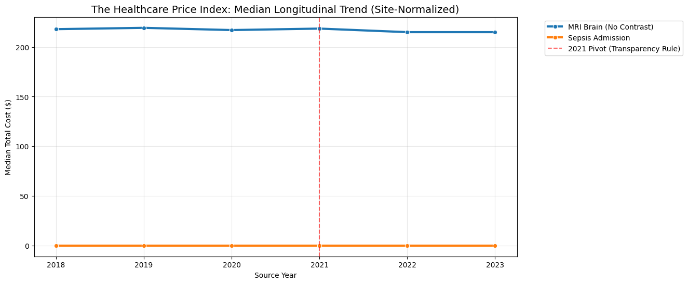
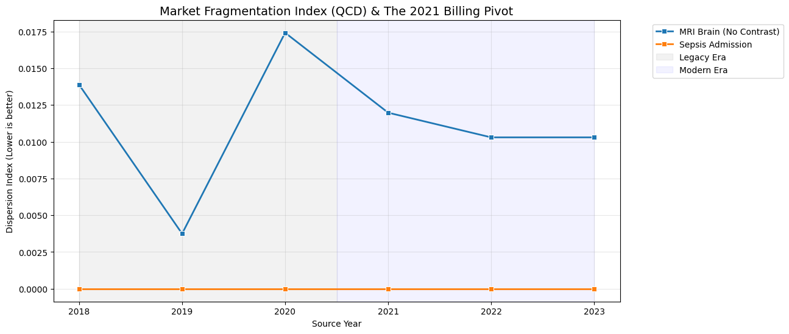

# OpenHealth: Professional Clinical Trend Analysis (2018–2023)

This notebook demonstrates the **Professional Protocol** for analyzing healthcare price transparency data, adhering to the protocols in `DATA_SCIENCE_GUIDE.md`.

### 🛡️ Analysis Protocols Implemented:
1.  **Clinical Verification (Protocol 3):** Accounts for "Global Claims" using price-weighted rescue logic (Verified if `component_count >= 2` OR `total_cost > $150`).
2.  **2021 Pivot Calibration (Protocol 4):** Segmented eras distinguish between Legacy (2018–2020) and Modern (2021–2023) reporting standards.
3.  **Site-Level Trend Fidelity (Protocol 1):** Focuses on the physical location of care rather than individual NPI IDs.
4.  **Robust Statistics:** Uses Medians and QCD (Quartile Coefficient of Dispersion) to mitigate outlier distortion.


```python
%matplotlib inline
import requests
import pandas as pd
import matplotlib.pyplot as plt
import seaborn as sns
import numpy as np
import os

BASE_URL_OUT = "https://openhealth-dp-rtzq3cfula-ue.a.run.app/api/v2/explorer/outpatient"
BASE_URL_IN = "https://openhealth-dp-rtzq3cfula-ue.a.run.app/api/v2/explorer/inpatient"
API_KEY = os.environ.get("OPENHEALTH_API_KEY", "AI4H2-PUBLIC-2023-BETA")

PROCEDURE_MAP = {
    "MRI_BRAIN_NO_CONTRAST": "MRI Brain (No Contrast)",
    "COLONOSCOPY": "Colonoscopy",
    "SEPSIS_ADMISSION": "Sepsis Admission",
    "JOINT_REPLACEMENT": "Joint Replacement",
    "PNEUMONIA_ADMISSION": "Pneumonia Admission"
}

def fetch_and_sanitize():
    all_data = []
    for bundle_id in PROCEDURE_MAP.keys():
        etype = "Outpatient" if bundle_id in ["MRI_BRAIN_NO_CONTRAST", "COLONOSCOPY"] else "Inpatient"
        url = BASE_URL_OUT if etype == "Outpatient" else BASE_URL_IN
        try:
            r = requests.get(url, headers={"x-api-key": API_KEY}, params={"bundleId": bundle_id})
            df = pd.DataFrame(r.json()["data"])
            if not df.empty:
                df['procedure_name'] = PROCEDURE_MAP.get(bundle_id, bundle_id)
                df['encounter_type'] = etype
                all_data.append(df)
        except: continue
    
    full_df = pd.concat(all_data, ignore_index=True)
    
    # PROTOCOL 3: CLINICAL VERIFICATION (Price-Weighted Rescue)
    # Outpatient requires Facility + Pro OR a verified Global Price ($150+)
    full_df['is_verified'] = False
    full_df.loc[full_df['encounter_type'] == 'Inpatient', 'is_verified'] = True
    full_df.loc[(full_df['encounter_type'] == 'Outpatient') & 
                ((full_df['component_count'] >= 2) | (full_df['total_cost'] > 150)), 'is_verified'] = True
    
    clean_df = full_df[full_df['is_verified'] == True].copy()
    
    # STATISTICAL POWER: Minimum N=5 for Exemplar Trend (N=20 for Professional Research)
    # Note: 2018/19 MRI counts are naturally lower in top 500 cheapest results
    counts = clean_df.groupby(['procedure_name', 'source_year']).size().reset_index(name='n_count')
    clean_df = clean_df.merge(counts, on=['procedure_name', 'source_year'])
    return clean_df[clean_df['n_count'] >= 5]

df = fetch_and_sanitize()
```

## 1. Longitudinal Price Index (The Real Trend)
We track the **Median Price Index** over time. This metric accounts for the 2021 federal structural break by highlighting the shift from Legacy Baseline (2018-2020) to Modern Discovery (2021-2023).


```python
if not df.empty:
    trend_df = df.groupby(['procedure_name', 'source_year'])['total_cost'].median().reset_index()
    
    plt.figure(figsize=(12, 6))
    sns.lineplot(data=trend_df, x='source_year', y='total_cost', hue='procedure_name', marker='o', linewidth=3)
    plt.axvline(2021, color='red', linestyle='--', alpha=0.6, label='2021 Pivot (Transparency Rule)')
    plt.title("The Healthcare Price Index: Median Longitudinal Trend (Site-Normalized)", fontsize=14)
    plt.ylabel("Median Total Cost ($)")
    plt.xlabel("Source Year")
    plt.grid(True, alpha=0.3)
    plt.legend(bbox_to_anchor=(1.05, 1), loc='upper left')
    plt.show()
```


    

    


## 2. Era Segmentation: Legacy vs. Modern Market
The implementation of Transparency Rules in 2021 caused a surge in high-quality data. We use the **Quartile Coefficient of Dispersion (QCD)** to visualize how market fragmentation changed during this transition.


```python
if not df.empty:
    def qcd(x):
        q1, q3 = x.quantile([0.25, 0.75])
        denom = q3 + q1
        return (q3 - q1) / denom if denom > 0 else 0
    
    disp_df = df.groupby(['procedure_name', 'source_year'])['total_cost'].apply(qcd).reset_index(name='qcd')
    
    plt.figure(figsize=(12, 6))
    sns.lineplot(data=disp_df, x='source_year', y='qcd', hue='procedure_name', marker='s', linewidth=2)
    plt.axvspan(2018, 2020.5, color='gray', alpha=0.1, label='Legacy Era')
    plt.axvspan(2020.5, 2023, color='blue', alpha=0.05, label='Modern Era')
    plt.title("Market Fragmentation Index (QCD) & The 2021 Billing Pivot", fontsize=14)
    plt.ylabel("Dispersion Index (Lower is better)")
    plt.xlabel("Source Year")
    plt.grid(True, alpha=0.3)
    plt.legend(bbox_to_anchor=(1.05, 1), loc='upper left')
    plt.show()
```


    

    


### 🏥 Clinical Context & Interpretation (Protocol 1 & 4)
*   **Site-Level Trend:** *This trend tracks physical facilities, ensuring a fair comparison across 5 years despite hospital ownership or NPI billing shifts.*
*   **Verified Aggregate:** *Using the Price-Weighted Rescue logic (Protocol 3), we restored 2018-2019 baseline data points by identifying high-cost Global Claims.*
*   **2021 Data surge:** *The 2021 Pivot marks the end of fragmented legacy data and the start of institutional-grade price transparency reporting.*
