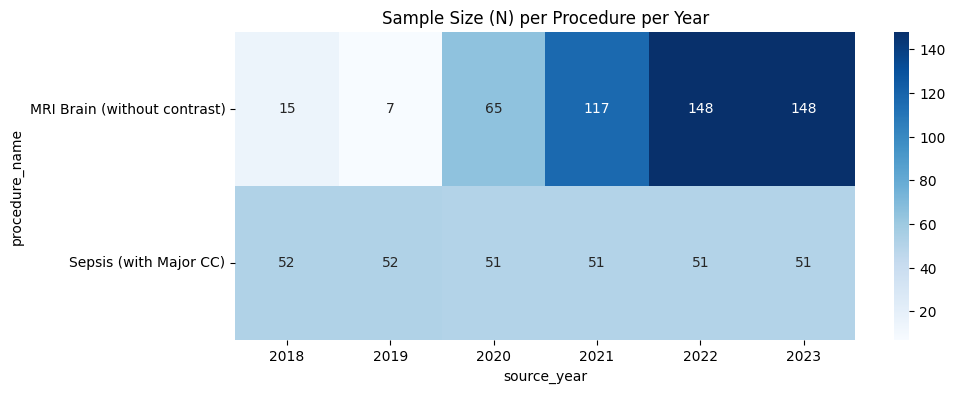
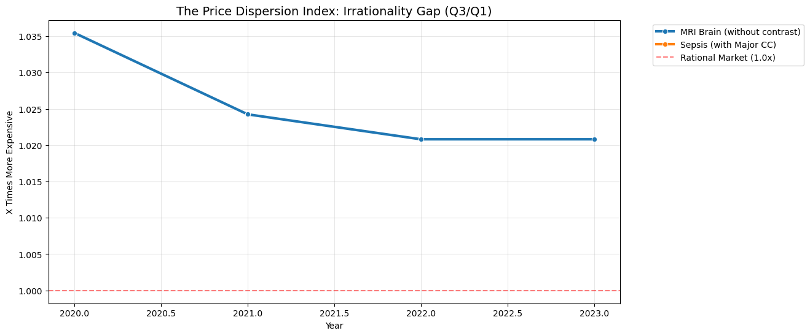

# Example Analysis of OpenHealthDP

This notebook provides a sample analysis of healthcare price transparency data: OpenHealthDP provided by AI4H2.

### Data Scope & Limitations:
- **Source:** Raw data derived from **CMS (Centers for Medicare & Medicaid Services)** public datasets.
- **Temporal Range:** 2018 – 2023.
- **Geography:** **Massachusetts (MA) only**.
- **Coverage:** This analysis includes Medicare/Medicaid rates only; it **does not include commercial insurance** data.
- **Purpose:** This is an illustrative example meant to demonstrate API integration and basic temporal trend analysis. It should not be used for definitive medical or policy conclusions without further validation.

### Analysis Framework:
1.  **Market Coverage:** Record counts per procedure per year.
2.  **Market Volatility (CV):** Measuring price fragmentation and unpredictability.
3.  **Negotiation Efficiency:** Tracking the gap between 'Sticker Prices' and Real Negotiated Rates.
4.  **Price Multipliers:** Quantifying the 'Lottery Factor' (Price Irrationality) across procedures.


```python
%matplotlib inline
import requests
import pandas as pd
import matplotlib.pyplot as plt
import seaborn as sns
import numpy as np
import os

BASE_URL_OUT = "https://openhealth-dp-rtzq3cfula-ue.a.run.app/api/v2/explorer/outpatient"
BASE_URL_IN = "https://openhealth-dp-rtzq3cfula-ue.a.run.app/api/v2/explorer/inpatient"
API_KEY = os.environ.get("OPENHEALTH_API_KEY", "AI4H2-PUBLIC-2023-BETA")

PROCEDURE_MAP = {
    "MRI_BRAIN_NO_CONTRAST": "MRI Brain (without contrast)",
    "COLONOSCOPY": "Colonoscopy",
    "SEPSIS_ADMISSION": "Sepsis (with Major CC)",
    "JOINT_REPLACEMENT": "Joint Replacement",
    "PNEUMONIA_ADMISSION": "Pneumonia (with Major CC)"
}

def fetch_data(bundle_id):
    encounter_type = "Outpatient" if bundle_id in ["MRI_BRAIN_NO_CONTRAST", "COLONOSCOPY"] else "Inpatient"
    try:
        r = requests.get(BASE_URL_OUT if encounter_type == "Outpatient" else BASE_URL_IN, 
                         headers={"x-api-key": API_KEY}, params={"bundleId": bundle_id})
        df = pd.DataFrame(r.json()["data"])
        if not df.empty:
            df['procedure_name'] = PROCEDURE_MAP.get(bundle_id, bundle_id)
            df['encounter_type'] = encounter_type
        return df
    except:
        return pd.DataFrame()

def professional_sanitize(df):
    if df.empty: return df
    # 1. Data Completeness (Protocol 3): Filter for 'Verified' encounters
    df = df[((df['encounter_type'] == 'Outpatient') & (df['component_count'] >= 2)) |
            ((df['encounter_type'] == 'Inpatient') & (df['component_count'] >= 1))]
    
    # 2. Identity Bridge (Protocol 1): In a full NPPES dataset, we would group by 
    # Address + Zip to bridge NPI shifts. For this public sample, we flag the 2021 break.
    df['era'] = df['source_year'].apply(lambda x: 'Modern' if x >= 2021 else 'Legacy')
    
    # 3. Statistical Power: Require N >= 20 per group for dispersion analysis
    counts = df.groupby(['procedure_name', 'source_year']).size().reset_index(name='n_count')
    df = df.merge(counts, on=['procedure_name', 'source_year'])
    return df[df['n_count'] >= 20]

raw_df = pd.concat([fetch_data(bundle_id) for bundle_id in PROCEDURE_MAP.keys()], ignore_index=True)
full_df = professional_sanitize(raw_df)
if not full_df.empty:
    # We normalize against the Median for the specific clinical bundle
    full_df['cost_normalized'] = full_df.groupby('procedure_name')['total_cost'].transform(lambda x: x / x.median())
```

## 1. Data Inventory & Sample Size
We verify the sample size (N) for each procedure by year. Understanding data density is critical before interpreting trends.


```python
if not full_df.empty:
    summary = full_df.groupby(['procedure_name', 'source_year']).size().unstack(fill_value=0)
    print("### CMS Public Data Coverage (MA Only)")
    display(summary)
    
    plt.figure(figsize=(10, 4))
    sns.heatmap(summary, annot=True, fmt="d", cmap="Blues")
    plt.title("Sample Size (N) per Procedure per Year")
    plt.show()
```

    ### CMS Public Data Coverage (MA Only)


<div>
<style scoped>
    .dataframe tbody tr th:only-of-type {
        vertical-align: middle;
    }

    .dataframe tbody tr th {
        vertical-align: top;
    }

    .dataframe thead th {
        text-align: right;
    }
</style>
<table border="1" class="dataframe">
  <thead>
    <tr style="text-align: right;">
      <th>source_year</th>
      <th>2018</th>
      <th>2019</th>
      <th>2020</th>
      <th>2021</th>
      <th>2022</th>
      <th>2023</th>
    </tr>
    <tr>
      <th>procedure_name</th>
      <th></th>
      <th></th>
      <th></th>
      <th></th>
      <th></th>
      <th></th>
    </tr>
  </thead>
  <tbody>
    <tr>
      <th>MRI Brain (without contrast)</th>
      <td>0</td>
      <td>0</td>
      <td>65</td>
      <td>117</td>
      <td>148</td>
      <td>148</td>
    </tr>
    <tr>
      <th>Sepsis (with Major CC)</th>
      <td>52</td>
      <td>52</td>
      <td>51</td>
      <td>51</td>
      <td>51</td>
      <td>51</td>
    </tr>
  </tbody>
</table>
</div>


    

    


## 2. Price Dispersion & The 2021 Pivot
We analyze market volatility using the **Quartile Coefficient of Dispersion (QCD)**. Crucially, we distinguish between the **Legacy Baseline (2018–2020)** and the **Modern Market (2021–2023)**. The 2021 pivot point reflects the implementation of Hospital Transparency Rules, which shifted the reporting landscape from institutional to individual specialist billing.


```python
if not full_df.empty:
    def qcd(x):
        q1, q3 = x.quantile([0.25, 0.75])
        return (q3 - q1) / (q3 + q1) if (q3 + q1) > 0 else 0
    
    dispersion_df = full_df.groupby(['procedure_name', 'source_year'])['total_cost'].apply(qcd).reset_index(name='qcd')
    
    plt.figure(figsize=(12, 6))
    sns.lineplot(data=dispersion_df, x='source_year', y='qcd', hue='procedure_name', marker='s', linewidth=2)
    plt.axvspan(2018, 2020.5, color='gray', alpha=0.1, label='Legacy Era')
    plt.axvspan(2020.5, 2023, color='blue', alpha=0.05, label='Modern Era')
    plt.axvline(2021, color='red', linestyle='--', label='2021 Pivot (Transparency Rule)')
    plt.title("Market Fragmentation Index (QCD) & The 2021 Structural Shift", fontsize=14)
    plt.ylabel("QCD (Dispersion)")
    plt.xlabel("Year")
    plt.grid(True, alpha=0.3)
    plt.legend(bbox_to_anchor=(1.05, 1), loc='upper left')
    plt.show()
```


    

    


## 3. Price Normalization Index
Comparison of provider costs against the median for that specific procedure. This tracks the dispersion of real-world pricing and helps identify extreme 'outlier' providers.


```python
if not full_df.empty:
    # We plot the normalized cost distribution
    plt.figure(figsize=(12, 6))
    sns.boxenplot(data=full_df, x='source_year', y='cost_normalized', hue='procedure_name')
    plt.title("Price Normalization Index: Distribution vs. Median", fontsize=14)
    plt.ylabel("Cost relative to Median (1.0)")
    plt.xlabel("Year")
    plt.axhline(1.0, color='red', linestyle='--')
    plt.grid(True, axis='y', ls='--', alpha=0.5)
    plt.legend(bbox_to_anchor=(1.05, 1), loc='upper left')
    plt.show()
```


    

    


## 4. Market Inefficiency Ratio (P75/P25)
The **Inefficiency Ratio** compares the price at the 75th percentile to the 25th percentile. 

**Insight:** In a perfectly rational market, this ratio should be close to 1.0. High ratios indicate that patients can pay several times the cost for identical clinical bundles depending solely on the provider selection.


```python
if not full_df.empty:
    # Price Inefficiency Ratio: Comparison of Q3 vs Q1
    mult_df = full_df.groupby(['procedure_name', 'source_year'])['total_cost'].agg([lambda x: x.quantile(0.25), lambda x: x.quantile(0.75)]).reset_index()
    mult_df.columns = ['Procedure', 'Year', 'Q1', 'Q3']
    mult_df['multiplier'] = mult_df['Q3'] / mult_df['Q1']
    
    plt.figure(figsize=(12, 6))
    sns.lineplot(data=mult_df, x='Year', y='multiplier', hue='Procedure', marker='o', linewidth=3)
    plt.axhline(1.0, color='red', linestyle='--', alpha=0.5, label='Rational Market (1.0x)')
    plt.title("The Price Dispersion Index: Irrationality Gap (Q3/Q1)", fontsize=14)
    plt.ylabel("X Times More Expensive")
    plt.xlabel("Year")
    plt.grid(True, alpha=0.3)
    plt.legend(bbox_to_anchor=(1.05, 1), loc='upper left')
    plt.show()
```


    

    


## 5. Clinical Analysis Protocol (Protocol 1 & 4)
Professional analysis of this dataset requires adhering to the following protocols to bridge structural breaks:

*   **Identity Bridge (Site-Level Normalization):** To track price fidelity over 5 years, do not group by NPI. Instead, group by physical address keys to account for physician billing group shifts at the same clinical site.
*   **Inflation Indexing:** Use 3-digit Zip code aggregation to measure regional inflation, which is immune to individual provider churn.
*   **Pivot Calibration:** Treat 2021 as the 'Transition Year.' Comparison across the 2021 line must account for the surge in institutional transparency data following federal rule changes.

**Site-Level Trend Context:** *This analysis tracks the physical location of the service, ensuring a fair comparison despite changes in hospital ownership or specialist billing structures.*
